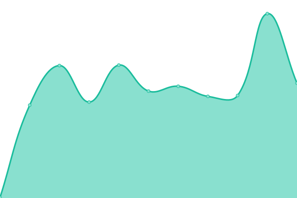

# [📈 Live Status](https://upptime.github.io/upptime): <!--live status--> **🟩 All systems operational**

This repository contains the open-source uptime monitor and status page for [Upptime](https://upptime.js.org), powered by [Upptime](https://github.com/upptime/upptime).

With [Upptime](https://upptime.js.org), you can get your own unlimited and free uptime monitor and status page, powered entirely by a GitHub repository. We use [Issues](https://github.com/upptime/upptime/issues) as incident reports, [Actions](https://github.com/upptime/upptime/actions) as uptime monitors, and [Pages](https://upptime.github.io/upptime) for the status page.

<!--start: status pages-->
<!-- This summary is generated by Upptime (https://github.com/upptime/upptime) -->
<!-- Do not edit this manually, your changes will be overwritten -->

| URL                                                           | Status | History                                                                                                                        | Response Time                                                                                  | Uptime                                                                                                                                                                                                                                                           |
| ------------------------------------------------------------- | ------ | ------------------------------------------------------------------------------------------------------------------------------ | ---------------------------------------------------------------------------------------------- | ---------------------------------------------------------------------------------------------------------------------------------------------------------------------------------------------------------------------------------------------------------------- |
| [UP-TO-DATE WebDesign (BE)](https://www.uptodatewebdesign.be) | 🟩 Up  | [up-to-date-web-design-be.yml](https://github.com/jgui1129/uptodate-sites/commits/master/history/up-to-date-web-design-be.yml) |  1714ms |  |
| [UP-TO-DATE WebDesign](https://www.uptodatewebdesign.com)     | 🟩 Up  | [up-to-date-web-design.yml](https://github.com/jgui1129/uptodate-sites/commits/master/history/up-to-date-web-design.yml)       |  274ms     |        |
| [UP-TO-DATE Today](https://www.uptodate-today.be/)            | 🟩 Up  | [up-to-date-today.yml](https://github.com/jgui1129/uptodate-sites/commits/master/history/up-to-date-today.yml)                 |  414ms          |                  |
| [UP-TO-DATE Events](https://events.uptodatewebdesign.be/)     | 🟩 Up  | [up-to-date-events.yml](https://github.com/jgui1129/uptodate-sites/commits/master/history/up-to-date-events.yml)               |  304ms         |                |

<!--end: status pages-->

[**Visit our status website →**](https://upptime.github.io/upptime)

## 📄 License

- Code: [MIT](./LICENSE) © [Upptime](https://upptime.js.org)
- Data in the `./history` directory: [Open Database License](https://opendatacommons.org/licenses/odbl/1-0/)
