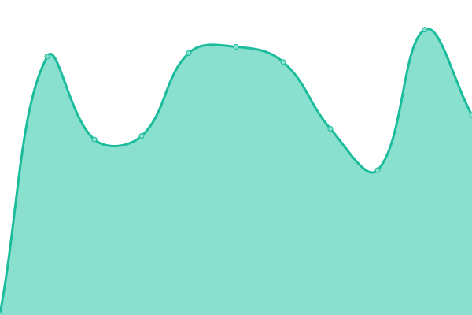
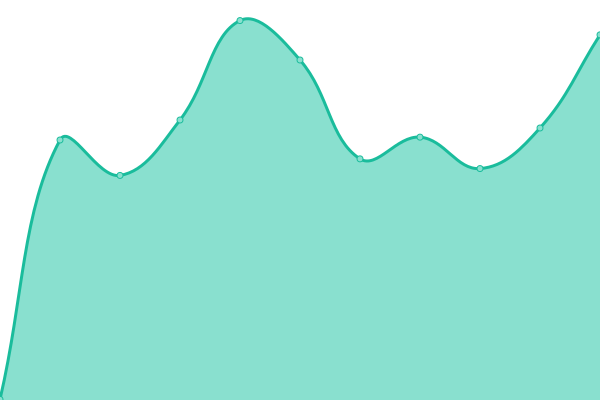
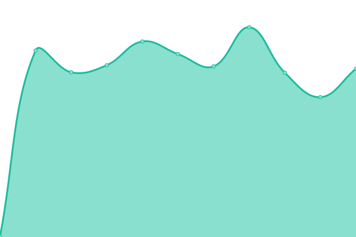
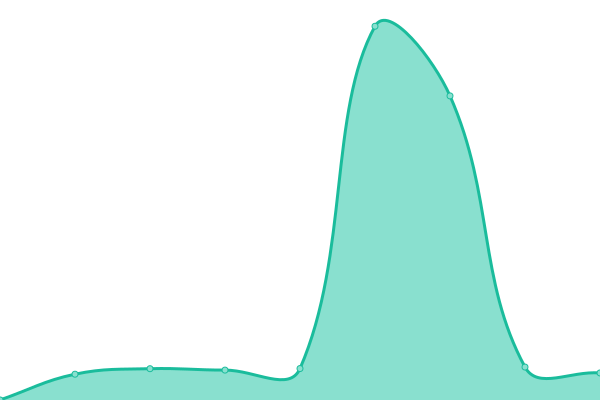
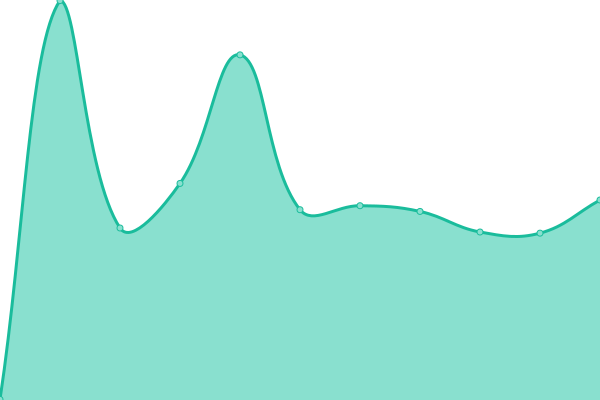

# [📈 Live Status](https://upptime.github.io/upptime): <!--live status--> **🟧 Partial outage**

This repository contains the open-source uptime monitor and status page for [Upptime](https://upptime.js.org), powered by [Upptime](https://github.com/upptime/upptime).

With [Upptime](https://upptime.js.org), you can get your own unlimited and free uptime monitor and status page, powered entirely by a GitHub repository. We use [Issues](https://github.com/upptime/upptime/issues) as incident reports, [Actions](https://github.com/upptime/upptime/actions) as uptime monitors, and [Pages](https://upptime.github.io/upptime) for the status page.

<!--start: status pages-->
<!-- This summary is generated by Upptime (https://github.com/upptime/upptime) -->
<!-- Do not edit this manually, your changes will be overwritten -->

| URL                                                             | Status  | History                                                                                                                        | Response Time                                                                                  | Uptime                                                                                                                                                                                                                                                           |
| --------------------------------------------------------------- | ------- | ------------------------------------------------------------------------------------------------------------------------------ | ---------------------------------------------------------------------------------------------- | ---------------------------------------------------------------------------------------------------------------------------------------------------------------------------------------------------------------------------------------------------------------- |
| [UP-TO-DATE WebDesign (BE)](https://www.uptodatewebdesign.be)   | 🟩 Up   | [up-to-date-web-design-be.yml](https://github.com/jgui1129/uptodate-sites/commits/master/history/up-to-date-web-design-be.yml) |  2045ms |  |
| [UP-TO-DATE WebDesign](https://www.uptodatewebdesign.com)       | 🟩 Up   | [up-to-date-web-design.yml](https://github.com/jgui1129/uptodate-sites/commits/master/history/up-to-date-web-design.yml)       |  263ms     |        |
| [UP-TO-DATE Today](https://www.uptodate-today.be)               | 🟩 Up   | [up-to-date-today.yml](https://github.com/jgui1129/uptodate-sites/commits/master/history/up-to-date-today.yml)                 |  385ms          |                  |
| [UP-TO-DATE Events](https://events.uptodatewebdesign.be)        | 🟩 Up   | [up-to-date-events.yml](https://github.com/jgui1129/uptodate-sites/commits/master/history/up-to-date-events.yml)               |  322ms         |                |
| [Smart-Site](https://www.smart-site.be)                         | 🟩 Up   | [smart-site.yml](https://github.com/jgui1129/uptodate-sites/commits/master/history/smart-site.yml)                             |  365ms                |                              |
| [Smart-Site Vastgoed](https://vastgoed-smart-site.blogspot.com) | 🟩 Up   | [smart-site-vastgoed.yml](https://github.com/jgui1129/uptodate-sites/commits/master/history/smart-site-vastgoed.yml)           |  264ms       |            |
| [Smart-Site Bouw](https://bouw-smart-site.blogspot.com)         | 🟩 Up   | [smart-site-bouw.yml](https://github.com/jgui1129/uptodate-sites/commits/master/history/smart-site-bouw.yml)                   |  548ms           |                    |
| [Dipsss](https://www.dipsss.be)                                 | 🟩 Up   | [dipsss.yml](https://github.com/jgui1129/uptodate-sites/commits/master/history/dipsss.yml)                                     |  403ms                    |                                      |
| [Smart-Site Zone](https://www.kinderrijck.be)                   | 🟩 Up   | [smart-site-zone.yml](https://github.com/jgui1129/uptodate-sites/commits/master/history/smart-site-zone.yml)                   |  419ms           |                    |
| [Kinderrijck](https://www.kinderrijck.be)                       | 🟩 Up   | [kinderrijck.yml](https://github.com/jgui1129/uptodate-sites/commits/master/history/kinderrijck.yml)                           |  81ms                |                            |
| [De Volmolen](https://www.vakantieverblijfvolmolen.be)          | 🟩 Up   | [de-volmolen.yml](https://github.com/jgui1129/uptodate-sites/commits/master/history/de-volmolen.yml)                           |  481ms               |                            |
| [Boetiek Shanna](https://www.boetiekshanna.be)                  | 🟩 Up   | [boetiek-shanna.yml](https://github.com/jgui1129/uptodate-sites/commits/master/history/boetiek-shanna.yml)                     |  380ms            |                      |
| [Bexx Verhuur](https://www.bexxverhuur.be)                      | 🟩 Up   | [bexx-verhuur.yml](https://github.com/jgui1129/uptodate-sites/commits/master/history/bexx-verhuur.yml)                         |  408ms              |                          |
| [TCMS](https://www.tcms.be)                                     | 🟩 Up   | [tcms.yml](https://github.com/jgui1129/uptodate-sites/commits/master/history/tcms.yml)                                         |  393ms                      |                                          |
| [Clima Concept](https://www.climaconcept.be/)                   | 🟥 Down | [clima-concept.yml](https://github.com/jgui1129/uptodate-sites/commits/master/history/clima-concept.yml)                       |  596ms             |                        |
| [ABC Villa](https://www.abcvilla.be)                            | 🟩 Up   | [abc-villa.yml](https://github.com/jgui1129/uptodate-sites/commits/master/history/abc-villa.yml)                               |  419ms                 |                                |

<!--end: status pages-->

[**Visit our status website →**](https://upptime.github.io/upptime)

## 📄 License

- Code: [MIT](./LICENSE) © [Upptime](https://upptime.js.org)
- Data in the `./history` directory: [Open Database License](https://opendatacommons.org/licenses/odbl/1-0/)
