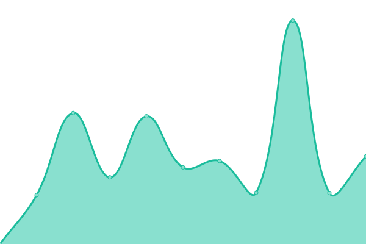
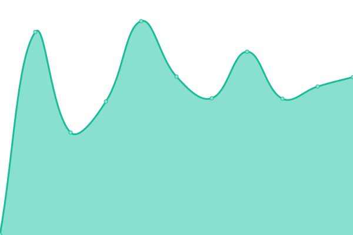
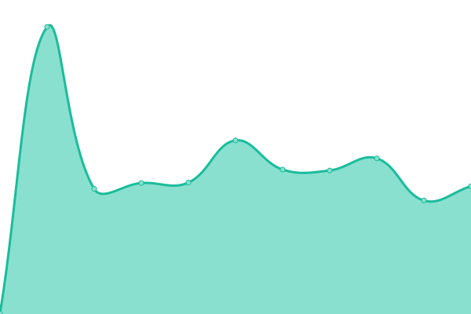
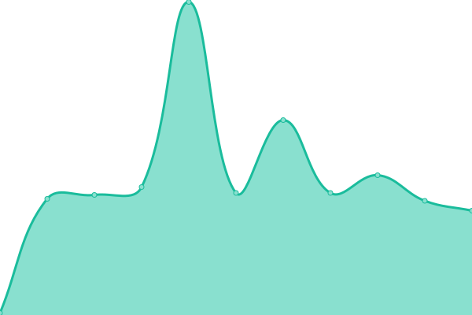

# [📈 Live Status](https://upptime.github.io/upptime): <!--live status--> **🟩 All systems operational**

This repository contains the open-source uptime monitor and status page for [Upptime](https://upptime.js.org), powered by [Upptime](https://github.com/upptime/upptime).

With [Upptime](https://upptime.js.org), you can get your own unlimited and free uptime monitor and status page, powered entirely by a GitHub repository. We use [Issues](https://github.com/upptime/upptime/issues) as incident reports, [Actions](https://github.com/upptime/upptime/actions) as uptime monitors, and [Pages](https://upptime.github.io/upptime) for the status page.

<!--start: status pages-->
<!-- This summary is generated by Upptime (https://github.com/upptime/upptime) -->
<!-- Do not edit this manually, your changes will be overwritten -->
<!-- prettier-ignore -->
| URL | Status | History | Response Time | Uptime |
| --- | ------ | ------- | ------------- | ------ |
| [UP-TO-DATE WebDesign (BE)](https://www.uptodatewebdesign.be) | 🟩 Up | [up-to-date-web-design-be.yml](https://github.com/jgui1129/uptodate-sites/commits/master/history/up-to-date-web-design-be.yml) | 

 2418ms
     
 | 

   

| [UP-TO-DATE WebDesign](https://www.uptodatewebdesign.com) | 🟩 Up | [up-to-date-web-design.yml](https://github.com/jgui1129/uptodate-sites/commits/master/history/up-to-date-web-design.yml) | 

 285ms
     
 | 

   

| [UP-TO-DATE Today](https://www.uptodate-today.be) | 🟩 Up | [up-to-date-today.yml](https://github.com/jgui1129/uptodate-sites/commits/master/history/up-to-date-today.yml) | 

 396ms
     
 | 

   

| [UP-TO-DATE Events](https://events.uptodatewebdesign.be) | 🟩 Up | [up-to-date-events.yml](https://github.com/jgui1129/uptodate-sites/commits/master/history/up-to-date-events.yml) | 

 333ms
     
 | 

   

| [Smart-Site](https://www.smart-site.be) | 🟩 Up | [smart-site.yml](https://github.com/jgui1129/uptodate-sites/commits/master/history/smart-site.yml) | 

 385ms
     
 | 

   

| [Smart-Site Vastgoed](https://vastgoed-smart-site.blogspot.com) | 🟩 Up | [smart-site-vastgoed.yml](https://github.com/jgui1129/uptodate-sites/commits/master/history/smart-site-vastgoed.yml) | 

 278ms
     
 | 

   

| [Smart-Site Bouw](https://bouw-smart-site.blogspot.com) | 🟩 Up | [smart-site-bouw.yml](https://github.com/jgui1129/uptodate-sites/commits/master/history/smart-site-bouw.yml) | 

 597ms
     
 | 

   

| [Dipsss](https://www.dipsss.be) | 🟩 Up | [dipsss.yml](https://github.com/jgui1129/uptodate-sites/commits/master/history/dipsss.yml) | 

 405ms
     
 | 

   

| [Smart-Site Zone](https://www.kinderrijck.be) | 🟩 Up | [smart-site-zone.yml](https://github.com/jgui1129/uptodate-sites/commits/master/history/smart-site-zone.yml) | 

 390ms
     
 | 

   

| [Kinderrijck](https://www.kinderrijck.be) | 🟩 Up | [kinderrijck.yml](https://github.com/jgui1129/uptodate-sites/commits/master/history/kinderrijck.yml) | 

 75ms
     
 | 

   

| [De Volmolen](https://www.vakantieverblijfvolmolen.be) | 🟩 Up | [de-volmolen.yml](https://github.com/jgui1129/uptodate-sites/commits/master/history/de-volmolen.yml) | 

 449ms
     
 | 

   

| [Boetiek Shanna](https://www.boetiekshanna.be) | 🟩 Up | [boetiek-shanna.yml](https://github.com/jgui1129/uptodate-sites/commits/master/history/boetiek-shanna.yml) | 

 379ms
     
 | 

   

| [Bexx Verhuur](https://www.bexxverhuur.be) | 🟩 Up | [bexx-verhuur.yml](https://github.com/jgui1129/uptodate-sites/commits/master/history/bexx-verhuur.yml) | 

 410ms
     
 | 

   

| [TCMS](https://www.tcms.be) | 🟩 Up | [tcms.yml](https://github.com/jgui1129/uptodate-sites/commits/master/history/tcms.yml) | 

 401ms
     
 | 

   

| [Clima Concept](https://www.climaconcept.be/) | 🟩 Up | [clima-concept.yml](https://github.com/jgui1129/uptodate-sites/commits/master/history/clima-concept.yml) | 

 1354ms
     
 | 

   

| [ABC Villa](https://www.abcvilla.be) | 🟩 Up | [abc-villa.yml](https://github.com/jgui1129/uptodate-sites/commits/master/history/abc-villa.yml) | 

 421ms
     
 | 

   

<!--end: status pages-->

[**Visit our status website →**](https://upptime.github.io/upptime)

## 📄 License

- Code: [MIT](./LICENSE) © [Upptime](https://upptime.js.org)
- Data in the `./history` directory: [Open Database License](https://opendatacommons.org/licenses/odbl/1-0/)
